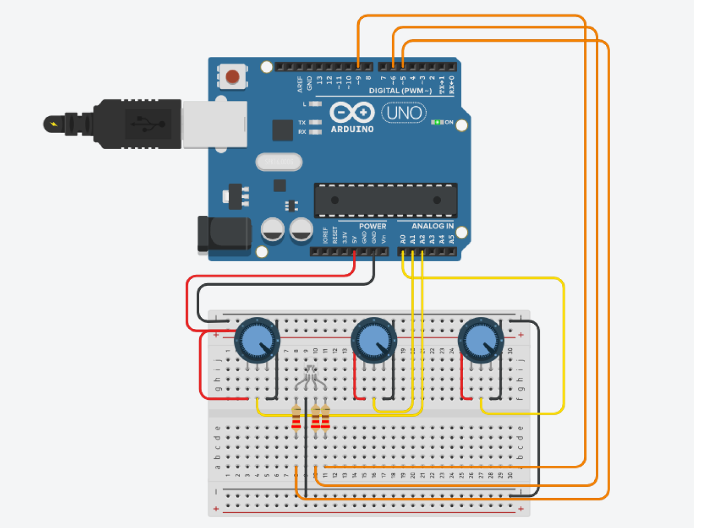
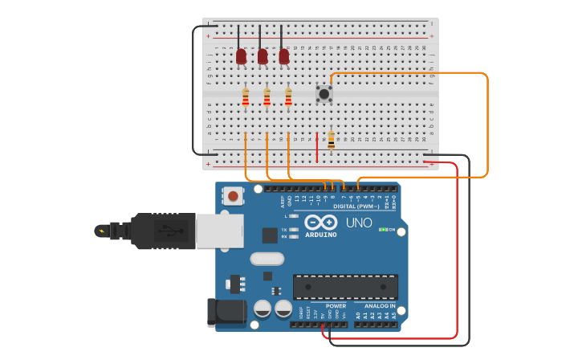
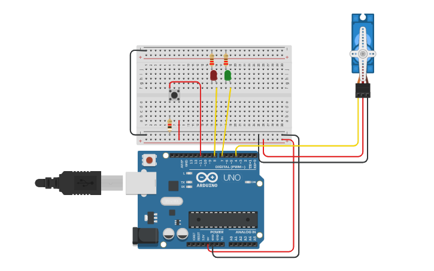
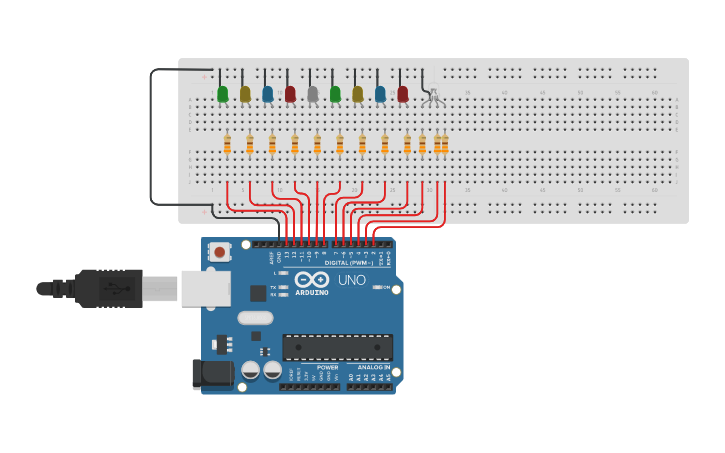

  

<h1 align="center">Arduino Projects</h1>

Arduino activities made at ETEC Albert Einstein

Activites
=================
<!--ts-->
   * [Potentiometer controlled RGB LED](#RGBbyPot)
   * [Button controlled LEDs](#LEDsbyButton)
   * [Servo Controlled by Button](#ServobyButton)
   * [LED Sequenced](#LEDSequence)
<!--te-->
## RGBbyPot
**Challenge:**
* Assign each RGB LED input to a potentiometer 
* When rotating a potentiometer, the color assigned to it will be gradually intensified.
* By simultaneously rotating two or more potentiometers the color will be mixed.

### Project structure

>

 
  

## LEDsbyButton
**Challenge:**
* The LEDs must respond to the button
* When pressing the button for the first time, all LEDs should light up and remain lit.
* When pressing the button a second time, all LEDs flash simultaneously.
* When pressing the button for the third time, the LEDs flash sequentially.
* When pressing the button for the fourth time, all LEDs turn off.
* If pressed again, the process is repeated.

### Project structure

>

 
  

## ServobyButton
**Challenge:**
* The servo and LEDs respond to the button.
* When pressing the button:
  * The MicroServo will rotate 90 degrees, symbolizing the gate opening.
  * A green LED will light up, symbolizing that the gate is open.
* When the button is released:
  * The MicroServo will return to its original position, symbolizing the closing of the gate.
  * A red LED will light up, symbolizing that the gate is closed.

### Project structure

>

 
  

## LEDSequence
**Challenge:**
* LEDs light up in order when the successor is on the previous one is off. 
* The LEDs light up in an orderly fashion and remain lit.
* when the last LED is on, they all turn off.
* All LEDs flash simultaneously 3 times.
* The LEDs light up in an orderly fashion and remain lit.
* when the last led is on, the leds turn off from back to front.
* All LEDs flash simultaneously 3 times.

### Project structure

>

 
  

## ProximitySensor
**Challenge:**
* LEDs light up in order when the successor is on the previous one is off. 
* The LEDs light up in an orderly fashion and remain lit.
* when the last LED is on, they all turn off.
* All LEDs flash simultaneously 3 times.
* The LEDs light up in an orderly fashion and remain lit.
* when the last led is on, the leds turn off from back to front.
* All LEDs flash simultaneously 3 times.

### Project structure

>

 
  

