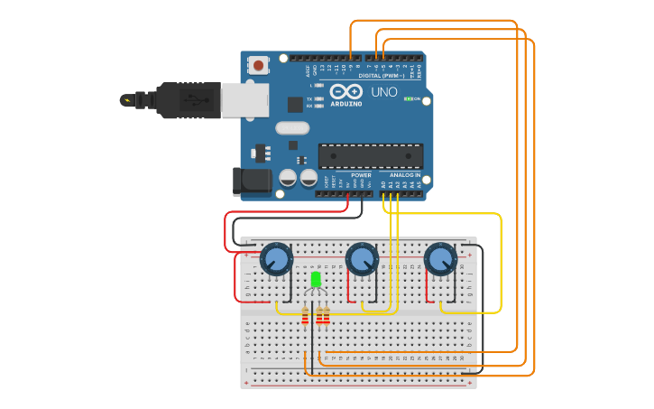

  

<h1 align="center">Arduino Projects</h1>

Arduino activities made at ETEC Albert Einstein

Activites
=================
<!--ts-->
   * [Potentiometer controlled RGB LED](#RGBbyPot)
   * [Button controlled LEDs](#LEDsbyButton)
<!--te-->
## RGBbyPot
**Challenge:**
* Assign each RGB LED input to a potentiometer 
* When rotating a potentiometer, the color assigned to it will be gradually intensified.
* By simultaneously rotating two or more potentiometers the color will be mixed.

### Project structure

>

 
  

## LEDsbyButton
**Challenge:**
* Read two inputs
* Show the Table of Operations
* Read the Operation
* Show the Results of the Operation

### Project structure

>

 
  

